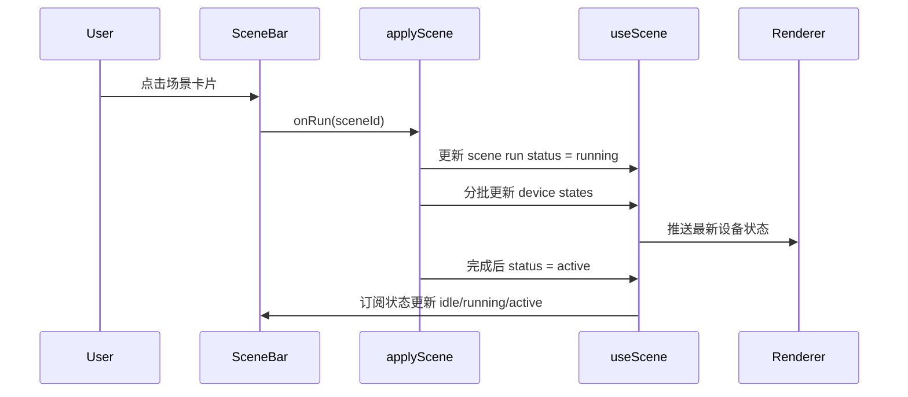
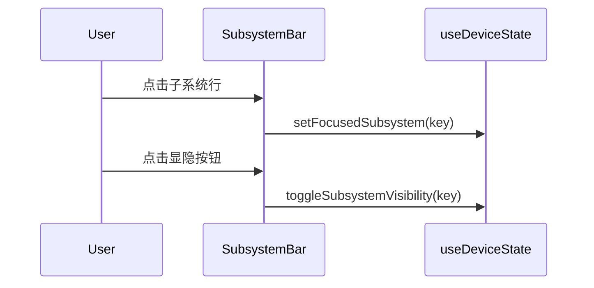
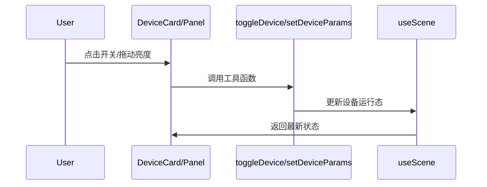

# VilHil Studio 状态流与事件流

## 1. 核心单向流

```text
User Action
  -> UI Event
  -> Tool Function
  -> useScene / useDeviceState
  -> Renderer/UI Repaint
```

规则：
1. 不允许组件之间隐式互改状态。
2. 关键业务动作必须有可观测状态。

## 2. 场景执行流（展示模式）



## 3. 子系统交互流



规则：
1. 聚焦与显隐分离。
2. 单次点击不触发双语义动作。

## 4. 设备交互流



## 5. 楼层过滤流

```text
Current Level Changed
  -> Scene/Device list recompute by levelId
  -> Proposal/UI panels re-render same scope
  -> Viewer keeps visual scope aligned
```

规则：
1. 禁止画布是 A 楼层而面板显示 B 楼层数据。

## 6. 变更记录

- 2026-04-17: 新增状态流文档，统一场景/子系统/设备/楼层事件流。
